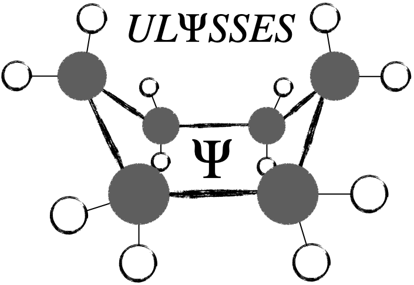

# ULYSSES

## Name
ULYSSES is a semi-empirical quantum chemical header-only library for C++. The current functionality includes several NDDO methods and GFN2-xTB. Dispersion and hydrogen bond corrections are available for many NDDO methods. Besides calculation of molecular and thermodynamic properties, geometry optimization, molecular dynamics and metadynamics are also available.

## Getting started
Get a C++ compiler. Build your own programs or use our templates. Run. No external libraries and no hacks should be needed. Ready to use and go.

## Integrate with your tools
Integrating the ULYSSES library in your code just requires you declaring the headers you need. 

## Detailed Description
The main focus of ULYSSES is to run semi-empirical calculations on chemical systems. The main header files required are listed below, with a brief description. For further detail, please check the main publication of the library (https://doi.org/10.1021/acs.jcim.2c00757), the example files or ask us.
* Molecule.hpp: class to manipule and process molecular information.
* BSet.hpp: declaration of basis set object.
* GFN.hpp: contains GFN2-xTB.
* MNDO.hpp: contains NDDO methods with s,p bases (MNDO, MNDO-PDDG, AM1, PM3, PM3-PDDG, PM3-BP, RM1).
* MNDOd.hpp: extension of NDDO methods to s,p,d bases (MNDOd, PM6).
* MolecularDynamics.hpp: module for MD calculations (still no PBC available).
* PES.hpp: module to scan 2-molecules PES.
* Gas.hpp: ideal gas thermodynamics.
* Solid.hpp: Debye model for crystal thermodynamics.

## Installation and Usage
Please note that ULYSSES is currently a serial implementation (no parallelization whatsoever). A soon to come extension will make the code compatible with OpenACC. 
No installation is required. Just a C++ compiler. Use the template programs or build your own. When compiling programs, we advise using the optimize the code with the compiler (e.g. -O3 option). There is no C++ specific standard required, except when using xsum. Then C++ 11 is needed.

## Support
For support, contact Filipe Menezes (filipe.menezes@helmholtz-muenchen.de).

## Contributions and Extensions
We are open for contributions and also particular requests. Contact Filipe Menezes (filipe.menezes@helmholtz-muenchen.de) if you want to add your own extension to our code or if you want to take part in our development plan.

## License
ULYSSES is distributed under AGPL3 (https://www.gnu.org/licenses/agpl-3.0.en.html). This means you are free to do what you want with the code. We kindly ask you however to share with us (and others) any improvements you make.
For the ease of use for a general audience, we also distribute any required libraries, which includes Eigen (license: MPL2), rapidjson (license: open source MIT) and xsum (LGPL). This means that the library you fetch by download or git clone is ready to use, but the libraries are on the other hand static (or manual update). If you want to link these libraries differently, you must change the headers in math/MatrixPackage.hpp for Eigen and rapidjson/json_interface.hpp for rapidjson.

## Citations
Header files containing semi-empirical methods should have documented the main references for each method. For ease of use, these are also transcribed here.

If you use ULYSSES:
* Menezes, F.; Popowicz, G. M. ULYSSES: An Efficient and Easy to Use Semiempirical Library for C++. J. Chem. Inf. Model. 2022, , . 10.1021/acs.jcim.2c00757

NDDO methods:
* MNDO: a) Dewar, M. J. S.; Thiel, W. Ground states of molecules. 38. The MNDO method. Approximations and parameters. J. Am. Chem. Soc. 1977, 99, 4899. 10.1021/ja00457a004; b) Dewar, M. J. S.; Thiel, W. A semiempirical model for the two-center repulsion integrals in the NDDO approximation. Theor. Chim. Acta (Berl.) 1977, 46, 89. 10.1007/BF00548085
* AM1: Dewar, M. J. S.; Zoebisch, E. G.; Healy, E. F.; Stewart, J. J. P. Development and use of quantum mechanical molecular models. 76. AM1: a new general purpose quantum mechanical molecular model. J. Am. Chem. Soc. 1985, 107, 3902. 10.1021/ja00299a024
* PM3: a) Stewart, J. J. P. Optimization of Parameters for Semi-Empirical Methods I. Method. J. Comput. Chem. 1989, 10, 209. 10.1002/jcc.540100208; b) Stewart, J. J. P. Optimization of parameters for semiempirical methods. III Extension of PM3 to Be, Mg, Zn, Ga, Ge, As, Se, Cd, In, Sn, Sb, Te, Hg, Tl, Pb, and Bi. J. Comput. Chem. 1991, 12, 320. 10.1002/jcc.540120306
* PM3-PDDG: a) Repasky, M. P.; Chandrasekhar, J.; Jorgensen, W. L. PDDG/PM3 and PDDG/MNDO: improved semiempirical methods. J. Comput. Chem. 2002, 23, 1601. 10.1002/jcc.10162; b) Tubert-Brohman, I.; Guimaraes, C. R. W.; Repasky, M. P.; Jorgensen, W. L. Extension of the PDDG/PM3 and PDDG/MNDO semiempirical molecular orbital methods to the halogens. J. Comput. Chem. 2004, 25, 138. 10.1002/jcc.10356; c) Tubert-Brohman, I.; Guimarães, C. R. W.; Jorgensen, W. L. Extension of the PDDG/PM3 Semiempirical Molecular Orbital Method to Sulfur, Silicon, and Phosphorus. J. Chem. Theory Comput. 2005, 1, 817. 10.1021/ct0500287
* MNDO-PDDG: a) Repasky, M. P.; Chandrasekhar, J.; Jorgensen, W. L. PDDG/PM3 and PDDG/MNDO: improved semiempirical methods. J. Comput. Chem. 2002, 23, 1601. 10.1002/jcc.10162; b) Tubert-Brohman, I.; Guimaraes, C. R. W.; Repasky, M. P.; Jorgensen, W. L. Extension of the PDDG/PM3 and PDDG/MNDO semiempirical molecular orbital methods to the halogens. J. Comput. Chem. 2004, 25, 138. 10.1002/jcc.10356
* PM3-BP: Giese, T. J.; Sherer, E. C.; Cramer, C. J.; York, D. M. A Semiempirical Quantum Model for Hydrogen-Bonded Nucleic Acid Base Pairs. J. Chem. Theory Comput. 2005, 1, 1275. 10.1021/ct050102l
* RM1: Rocha, G. B.; Freire, R. O.; Simas, A. M.; Stewart, J. J. P. RM1: a reparameterization of AM1 for H, C, N, O, P, S, F, Cl, Br, and I. J. Comput. Chem. 2006, 27, 1101. 10.1002/jcc.20425
* MNDOd: a) Thiel, W.; Voityuk, A. A. Extension of MNDO to d Orbitals: Parameters and Results for the Second-Row Elements and for the Zinc Group. J. Phys. Chem. 1996, 100, 616-626. 10.1021/jp952148o; b) Thiel, W.; Voityuk, A. A. Extension of the MNDO formalism to d orbitals: Integral approximations and preliminary numerical results. Theor. Chim. Acta 1992, 81, 391. 10.1007/BF01134863
* PM6: Stewart, J. J. P. Optimization of parameters for semiempirical methods V: Modification of NDDO approximations. J. Mol. Model. 2007, 13, 1173. 10.1007/s00894-007-0233-4

GFN2-xTB: 
* Bannwarth, C.; Ehlert, S.; Grimme, S. GFN2-xTB - An Accurate and Broadly Parametrized Self-Consistent Tight-Binding Quantum Chemical Method with Multipole Electrostatics and Density-Dependent Dispersion Contributions. J. Chem. Theory Comput. 2019, 15, 1652-1671. 10.1021/acs.jctc.8b01176

Non-Bonded Corrections:
* D3: Grimme, S.; Antony, J.; Ehrlich, S.; Krieg, H. A consistent and accurate ab initio parametrization of density functional dispersion correction (DFT-D) for the 94 elements H-Pu. J. Chem. Phys. 2010, 132, 154104. 10.1063/1.3382344
* D4: Caldeweyher, E.; Ehlert, S.; Hansen, A.; Neugebauer, H.; Spicher, S.; Bannwarth, C.; Grimme, S. A generally applicable atomic-charge dependent London dispersion correction. J. Chem. Phys. 2019, 150, 154122. 10.1063/1.5090222
* H4: Rezac, J.; Hobza, P. Advanced Corrections of Hydrogen Bonding. J. Chem. Theory Comput. 2012, 8, 141-151. 10.1021/ct200751e
* X: Rezac, J.; Hobza, P. A halogen-bonding correction for the semiempirical PM6 method. Chem. Phys. Lett. 2011, 506, 286-289. 10.1016/j.cplett.2011.03.009
* H+: Kromann, J. C.; Christensen, A. S.; Steinmann, C.; Korth, M.; Jensen, J. H. A third-generation dispersion and third-generation hydrogen bonding corrected PM6 method: PM6-D3H+. Peer J. 2014, 2, e449. 10.7717/peerj.449

Please note that certain methods or even specific element parameterisations might require additional references. These may be found in the ULYSSES paper. Lists of available elements are available from the supplementary material.

Filipe and Grzegorz# ulysses-library
